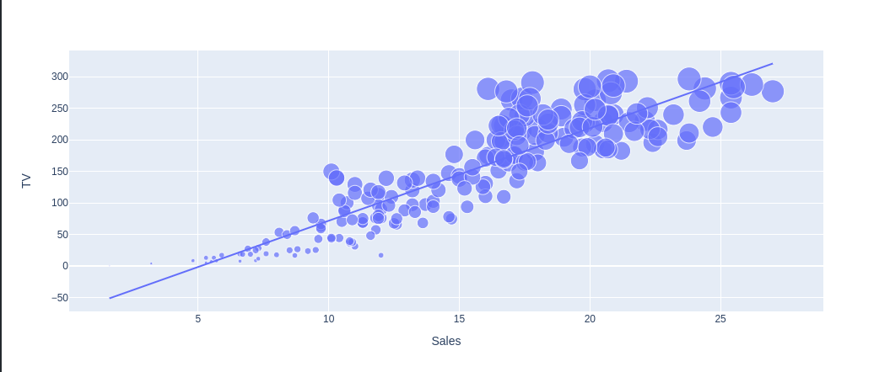

# 📊 Project Title: Sales per Unit vs. Newspaper, TV, and Radio
# 📌 Project Overview

This project analyzes the impact of advertising expenditure on sales per unit across three different mediums: Newspaper, TV, and Radio. The goal is to determine which channels most effectively drive sales and provide strategic recommendations for optimizing the marketing budget.##
## 🔑 Key Findings

   ### 📺 TV Advertising:
        Strong Positive Correlation: TV advertising spend shows a significant positive impact on sales per unit, making it the most effective medium in driving sales.

   ###  📻 Radio Advertising:
        Moderate Positive Impact: Radio advertising also contributes positively to sales, though its impact is less pronounced than TV. It remains a cost-effective channel, particularly in targeted markets.

    ### 📰 Newspaper Advertising:
        Weak Correlation: Newspaper ads exhibit the least impact on sales, indicating a potential decline in the effectiveness of print media compared to digital channels.

   ### 🔗 Combined Effect:
        Synergistic Uplift: Using all three mediums together results in a noticeable sales uplift, with TV being the dominant driver. The synergy between TV and Radio advertising is especially strong.

### 🗂️ Project Structure

    ### 📥 Data Collection:
        The dataset includes advertising spend across Newspaper, TV, and Radio, along with corresponding sales figures.

   ### 🧹 Data Cleaning:
        Addressed missing values and outliers to ensure high data quality.

   ### 🔍 Exploratory Data Analysis (EDA):
        Visualized relationships between variables using scatter plots, heatmaps, and correlation matrices.

   ### 🤖 Modeling:
        Developed linear regression models to quantify the impact of each advertising medium on sales.

    ### 📈 Key Insights:
        Summarized findings with actionable recommendations for optimizing advertising spend.

### 💡 Recommendations

    Increase TV Budget:
        Allocate a larger portion of the budget to TV advertising, given its strong correlation with sales.
    Optimize Radio Spend:
        Continue investing in Radio, especially for regional campaigns where it shows strong returns.
    Reevaluate Newspaper Spend:
        Consider reducing or reallocating funds from Newspaper advertising to more impactful channels like TV and Radio.

🛠️ Tools & Technologies

    Python: For data analysis and modeling.
    Pandas & NumPy: Data manipulation and statistical analysis.
    Matplotlib & Seaborn: Data visualization.
    Scikit-learn: Regression modeling.

📝 Conclusion

This analysis demonstrates that TV and Radio are the most effective advertising mediums for driving sales. Strategic budget allocation towards these channels, while reducing Newspaper spend, is recommended to maximize return on investment.

